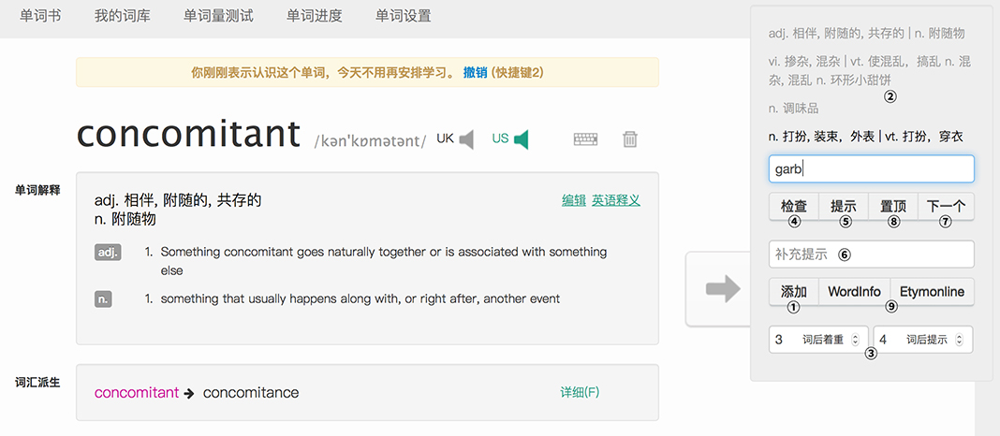

## 一些增强扇贝单词网页版的js脚本

### 功能简介

加载该插件后会在浏览器页面右上角显示一个操作框，您可以一边背单词，一边将当前单词添加到插件为您保存的列表中，并随后通过拼写来检查记忆情况

1. 在单词内容页面里按下 `添加` 或者键盘左上 `~` 键，将单词添加入列表
2. 单词词义将以列表的形式出现在操作框里
3. 您可以控制当列表中的单词数超过多少时，以突出的颜色来提示
4. 在拼写框中输入单词拼写后按下 `检查` 或键盘 `ENTER` 键，检查拼写是否正确
5. 每按下一次 `提示` 或键盘 `→` 键后，单词会从第一个字母开始为您逐个显示
6. 您还可以在添加单词的同时为单词提供一个一次性的助记提示，当第一次按下 `提示` 时会为您显示
7. 直接按下 `下一个` 或者在拼写已经检查正确后再次按下键盘 `ENTER` 键，跳过当前单词
8. `置顶` 键或键盘 `↑` 键会将当前单词放回列表顶端再次复习
9. 您可以点击这里跳转到 [WordInfo](http://wordinfo.info) 与 [Etymonline](http://www.etymonline.com) 这两个词根及词源数据库直接检索当前单词

### 加载方式

为您心爱的浏览器下载 TamperMonkey 或者其他的支持 Userscripts 的脚本管理器插件，在其中添加本脚本即可。添加方法包括：

1. 您可以下载该 `.js` 文件，在插件中以文件方式加载
2. 或者使用 URL `https://github.com/lytze/shanbay-js-ext/blob/master/spelling_quick_review.js` 加载该脚本
3. 您可以前往该脚本的 [greasyfork.org](https://greasyfork.org/zh-CN/scripts/34450-扇贝单词拼写检查) 界面来下载

### 更新日志

#### 1.0.1

__键盘控制__ 添加提示和置顶两个功能的快捷键
__说明文本__ 下载链接语言版本修正为中文

#### 1.0.0

__加载方式__ 现在此脚本可以作为 UserScripts 直接添加到支持该格式的脚本管理器中
